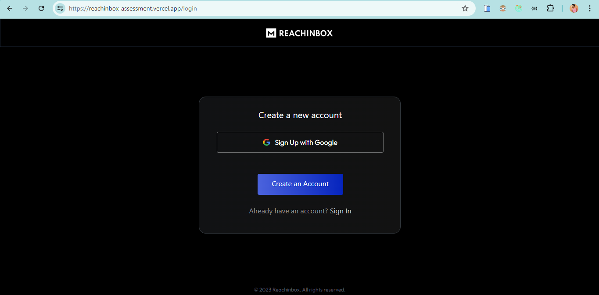
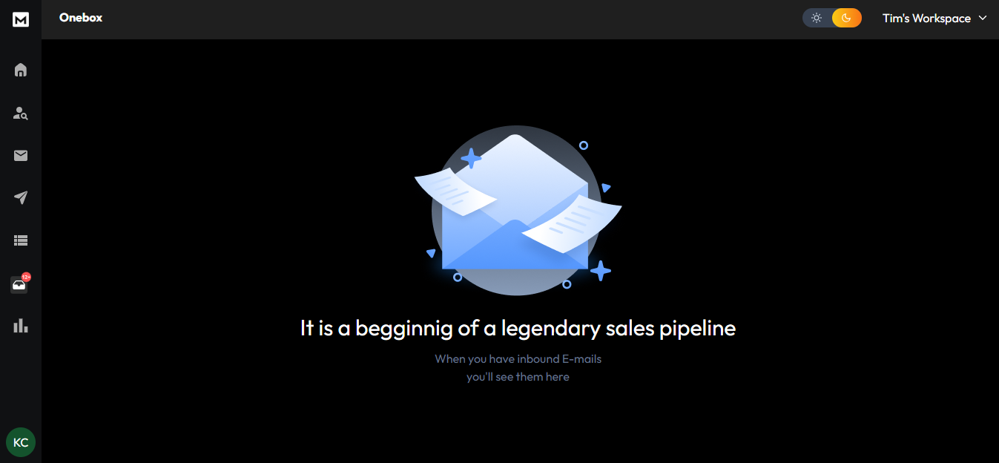
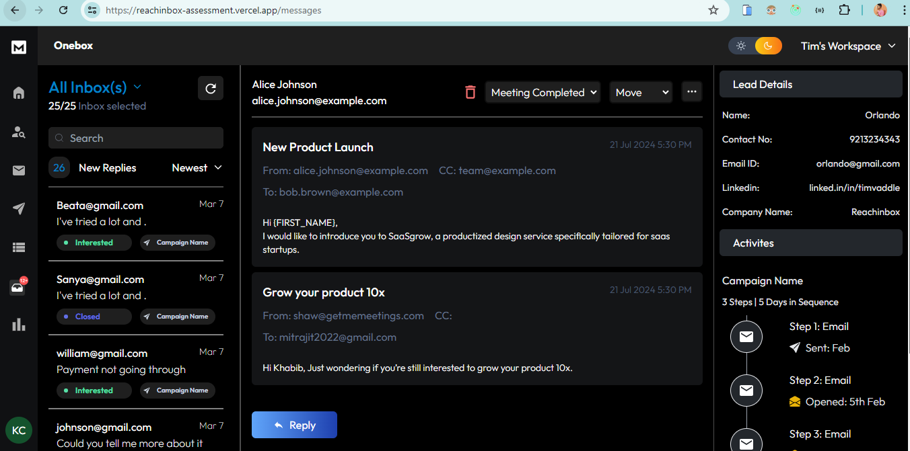
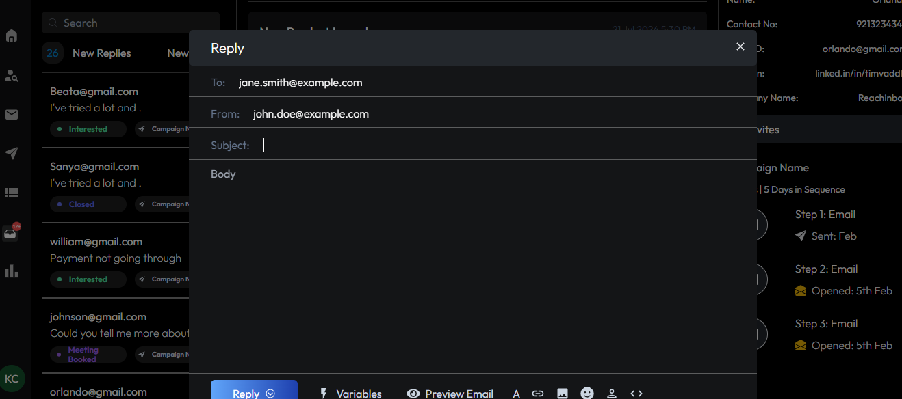
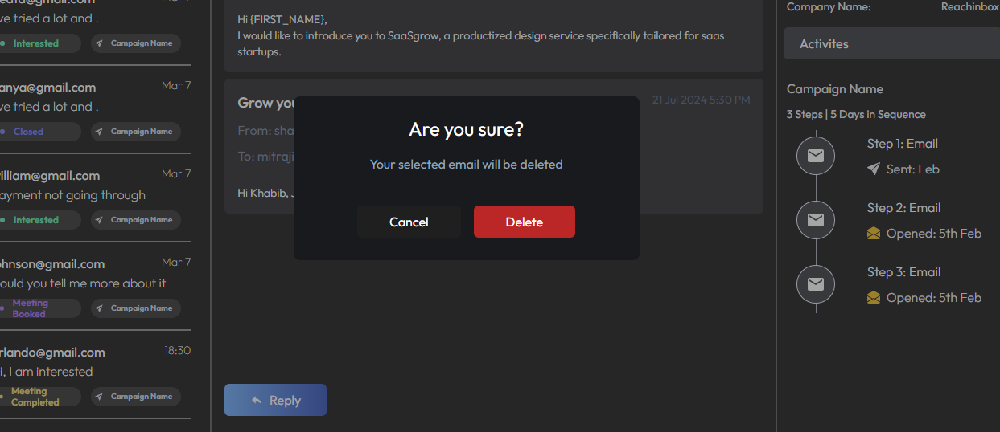
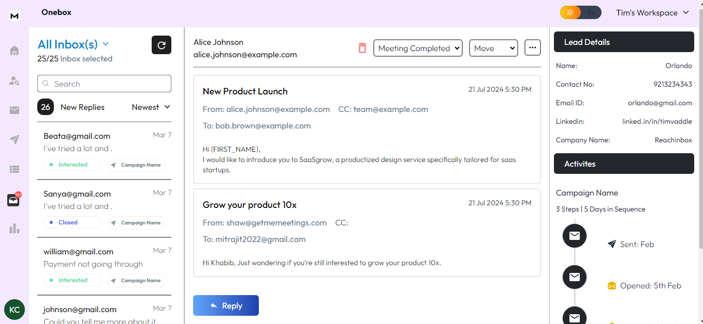

## Reachinbox Frontend Assessment

## Deployed Link :
https://reachinbox-assessment.vercel.app/

## Tech Stack used:
* React.js
* Redux Toolkit
* Tailwind.css

## Implementation :
* Converted given Figma Design into code
* User can login using google account Authentication
* Switch theme light or dark
* Implemented Reply and Delete Design Modal, where on pressing keyboard shortcuts in onebox - “D”  delete the email. “R” opens Reply box

## ScreenShot :
* Login Page :
  

* Home Page :
  

* Inbox Page :
  

* Email Reply Page :
  

* Email Delete Modal :
  

* Light Mode Page :
  

## Project Setup

* git clone https://github.com/Keegan-20/reachinbox-assessment.git
* npm install
* npm run dev

### Thank you !